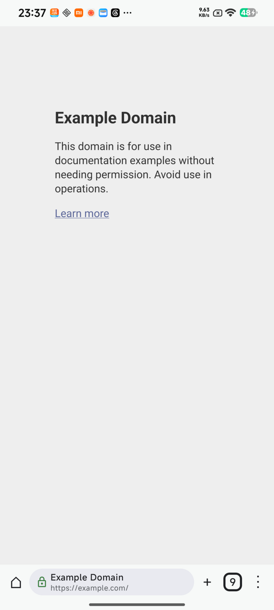
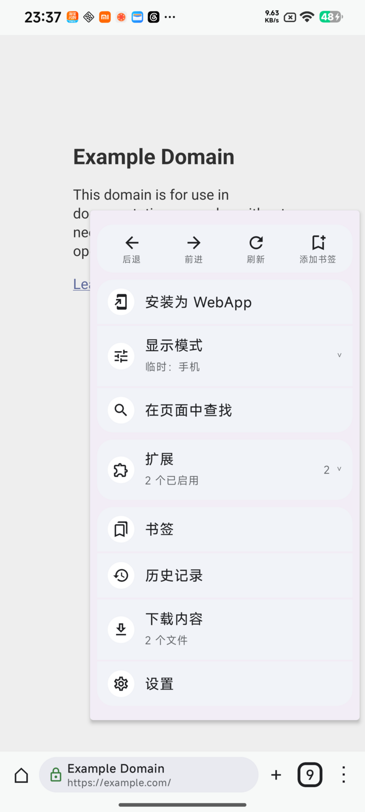
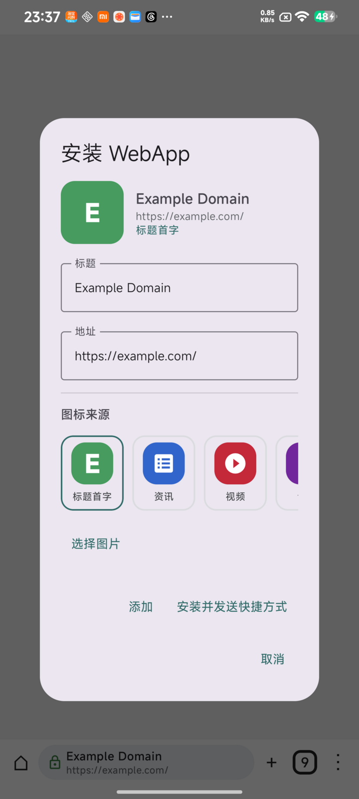

# Hyper Browser

> 一款为 Android 打造的开源浏览器，让扩展、WebApp 和自托管同步真正融入移动端浏览。

[下载 APK](https://github.com/BigSweetPotatoStudio/hyper-browser/releases) ·
[查看变更](CHANGELOG.md) ·
[隐私说明](PRIVACY.md) ·
[参与贡献](CONTRIBUTING.md)

Hyper Browser 把日常网页浏览、兼容的浏览器扩展和 WebApp 安装放在同一个应用里。它以手机上的触控体验为中心：界面保持熟悉、常用操作触手可及，同时给愿意自己掌控浏览器的人更多选择。

项目目前仍处于早期测试阶段，适合尝鲜、测试和个人使用。

  
  
  

真实 Android 设备截图：网页浏览、主菜单与 WebApp 安装。

## 为什么做 Hyper Browser

手机浏览器通常在“足够简单”和“足够自由”之间做取舍。Hyper Browser 希望把两者放在一起：

- 像普通浏览器一样直接打开网页、搜索、管理标签和下载内容。
- 像 App 一样保存常用网站，拥有独立入口和图标。
- 安装兼容的浏览器扩展，而不只依赖浏览器内置功能。
- 不要求注册云端账号；需要跨设备时，可以连接自己的 WebDAV。

## 主要功能

### 为手机设计的浏览体验

- 熟悉的地址栏、标签计数和主菜单，地址栏可放在顶部、底部或悬浮位置。
- Card / List 两种标签视图，支持滑动切换标签、滑动关闭与撤销误关。
- 书签、历史记录、下载管理、页面内查找和可恢复的浏览会话。
- 手机、平板、电脑三种网站显示模式，以及适合长文阅读的阅读模式。

### 把网站变成 WebApp

- 当前网页可以直接保存为 WebApp，自定义名称与图标。
- 可创建 Android 桌面快捷方式，像打开普通 App 一样进入网站。
- WebApp 与浏览器共享登录状态，不需要重复登录。
- 首页可以整理常用 WebApp 和入口，形成自己的移动工作台。

### 在 Android 上使用浏览器扩展

- 搜索并安装兼容 Android 的 WebExtension / XPI。
- 在主菜单中直接打开扩展 action 或 popup。
- 支持启用、停用、更新和卸载扩展。

扩展兼容性取决于 GeckoView 和 Android 能力，并不等同于桌面 Firefox 的完整扩展环境。

### 媒体、隐私与同步

- 支持后台媒体播放增强、媒体通知和多标签音频场景。
- 提供 DNS over HTTPS、HTTPS-Only 和多档跟踪保护设置。
- 浏览器数据默认保存在 App 私有目录。
- 可通过自备 WebDAV 同步书签、WebApp 和首页布局，无需 Hyper Browser 账号。

## 下载与安装

前往 [GitHub Releases](https://github.com/BigSweetPotatoStudio/hyper-browser/releases) 下载 APK：

- `arm64-v8a`：适用于绝大多数现代 Android 手机。
- `x86_64`：适用于部分模拟器和 x86 Android 设备。

Hyper Browser 支持 Android 8.0 及以上版本。首次安装 GitHub 下载的 APK 时，Android 可能会要求你允许当前应用“安装未知应用”。

带有 `beta` 标记的版本是预发布测试版，需要从 Releases 页面手动下载安装；App 内稳定更新通道只提供正式版本。

## 当前状态

Hyper Browser 仍在积极开发中，还不是经过大规模安全审计的稳定浏览器。当前已知边界包括：

- 暂无隐身模式。
- 暂无官方账号或托管同步服务。
- 暂未通过 Play Store 或 F-Droid 分发。
- 部分桌面扩展 API 在 Android / GeckoView 中不可用。

如果你依赖特定网站、身份验证流程或扩展，请先在测试环境中确认兼容性。

## 文档与参与

- [变更记录](CHANGELOG.md)
- [隐私说明](PRIVACY.md)
- [安全策略](SECURITY.md)
- [贡献指南](CONTRIBUTING.md)
- [发布流程](docs/RELEASE.md)
- [WebDAV 同步说明](docs/SYNC.md)
- [第三方组件说明](THIRD_PARTY_NOTICES.md)

欢迎提交问题、兼容性反馈和改进建议。开发环境、构建命令和提交要求请查看 [贡献指南](CONTRIBUTING.md)。

## License

Hyper Browser 使用 [Apache License 2.0](LICENSE) 开源。
